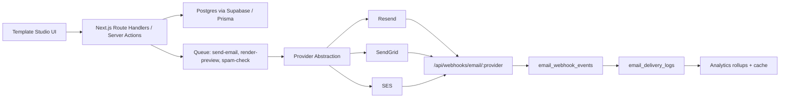

# Email Template Management System

This project now treats templates as a production SaaS surface: lifecycle teams can search, filter, preview, edit, validate, version, test, and monitor delivery from one studio.

## Product Screens

- **Template Library**: grid/table toggle, full-text search, status/type filters, updated/created/usage/last-sent sorting, favorites, folders, recently edited, and bulk archive/duplicate/export/delete affordances.
- **Template Editor**: visual and HTML modes, block insertion for text/image/button/divider/columns/social sections, placeholder autocomplete, missing variable detection, mock JSON preview, desktop/mobile/dark previews, and keyboard shortcuts.
- **Testing + Delivery**: provider selector for Resend, SendGrid, and SES, test email send, retry/failover design, rate-limit checklist, spam warning, and delivery-status panel.
- **Versioning + Collaboration**: draft/published model, version history, compare/rollback affordances, comments, approvals, reviewer mode, presence avatars, and audit trail surface.
- **Analytics**: sends, delivery, open, click, bounce, unsubscribe cards plus provider performance and recent delivery logs.

## Backend Architecture

## API Design

| Method | Path | Purpose |
| --- | --- | --- |
| `GET` | `/api/templates?q=&status=` | Browse/search templates |
| `POST` | `/api/templates` | Create draft template |
| `GET/PATCH/DELETE` | `/api/templates/:id` | Load, update, archive/delete |
| `POST` | `/api/templates/:id/preview` | Render with mock JSON payload |
| `POST` | `/api/templates/:id/test` | Send test via selected provider |
| `POST` | `/api/webhooks/email/:provider` | Normalize delivery webhook events |
| Future | `/api/templates/:id/versions` | Create, publish, compare, rollback versions |
| Future | `/api/templates/:id/comments` | Reviewer comments and resolution |
| Future | `/api/templates/:id/approvals` | Approval workflow state machine |

## Provider Abstraction

`lib/email/send.ts` exposes a provider-neutral `sendEmail()` and `normalizeProviderWebhook()`. Resend is live because the app already depends on it. SendGrid and SES adapters intentionally fail closed until credentials/SDKs are added, but the UI and route contracts are provider-aware.

Provider responsibilities:

- Map a neutral send input to provider payload.
- Return `{ id, provider, status, attempts }`.
- Normalize webhook payloads into `DeliveryWebhookEvent`.
- Preserve idempotency keys so queue retries do not double-send.
- Fail over from primary to secondary providers for transient provider outages.

## Database

Two database artifacts are included:

- `supabase/migrations/20250522000003_template_management_system.sql`: additive Supabase/Postgres migration for versions, partials, comments, approvals, audit logs, delivery logs, and webhook events.
- `prisma/schema.prisma`: production Prisma model for teams that want Prisma Client on top of Postgres.

Important indexes:

- `templates_kind_status_idx` for filtered library browsing.
- `templates_tags_idx` and `templates_placeholders_idx` for tag/variable search.
- `template_versions_template_created_idx` for version history.
- `email_delivery_logs_provider_idx` for provider analytics.
- Unique webhook event key on provider/message/type/time for idempotent ingestion.

## Queue Architecture

Use a durable queue such as Inngest, Trigger.dev, BullMQ, or Cloud Tasks with these jobs:

- `email.render`: compile Handlebars/Liquid-style templates, sanitize HTML, validate placeholders.
- `email.spam_check`: score subject/body before approval or test send.
- `email.send`: enforce rate limits, idempotency, retries, and provider failover.
- `email.webhook.process`: update delivery logs and analytics rollups from webhook events.
- `template.analytics.rollup`: materialize daily template/provider metrics.

Retry policy:

- Network/5xx: exponential backoff with jitter.
- 4xx validation: fail permanently and surface to audit log.
- Provider rate limit: retry after provider reset header.
- Idempotency: deterministic key from template version, recipient, campaign/trigger, and event id.

## Caching + Scaling

- Cache library queries by workspace, filters, and cursor with short TTL plus revalidation after mutations.
- Keep editor draft state local and autosave to `template_versions`.
- Use cursor pagination on `(updated_at, id)` for large workspaces.
- Store rendered previews in memory briefly, keyed by version hash + payload hash.
- Roll up analytics hourly/daily rather than aggregating raw webhook events on every dashboard load.

## Concurrency

- Use optimistic UI for stars, bulk archive, and draft saves.
- Include `updated_at` or version number in mutations to detect stale writes.
- Publish by transaction: create immutable version, set `published_version_id`, append audit row.
- Multi-user editing should use document CRDTs or Yjs presence for rich editor state, with comments anchored to stable document positions.

## Security

- Sanitize HTML on save and render with an allowlist for email-safe tags/attributes.
- Escape placeholder output by default; require explicit safe HTML helpers.
- Verify webhook signatures for each provider before inserting events.
- Scope all queries by workspace and role.
- Admin/editor/viewer permissions should gate mutation, publish, approval, and test-send actions.
- Store provider secrets server-side only; never expose them to Client Components.
